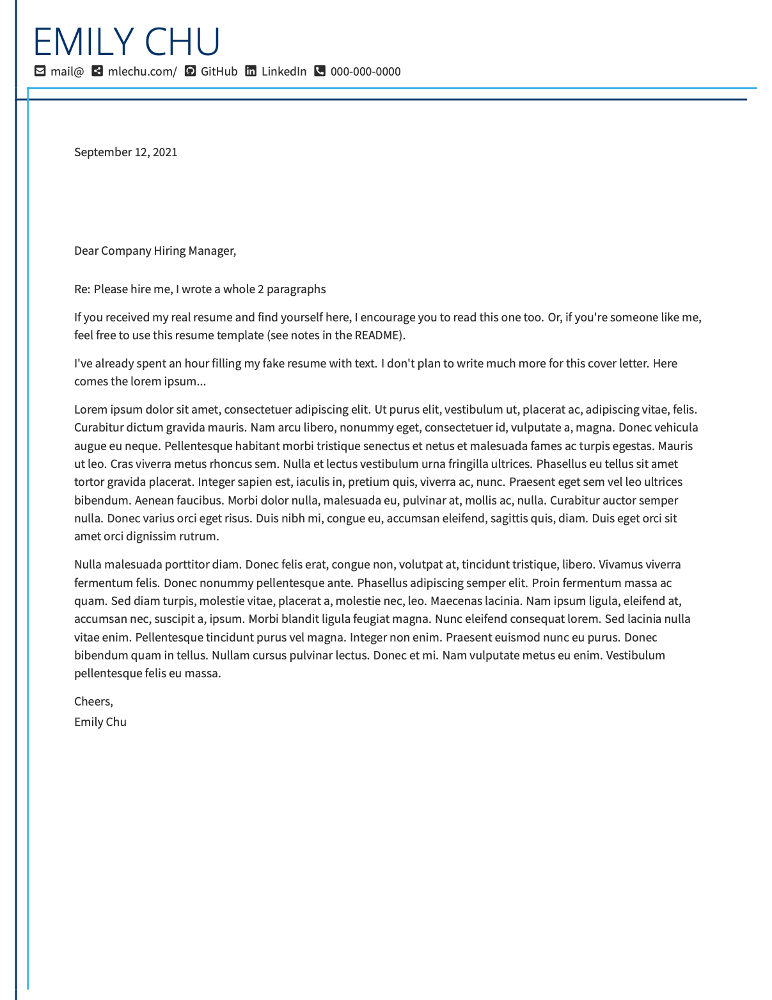
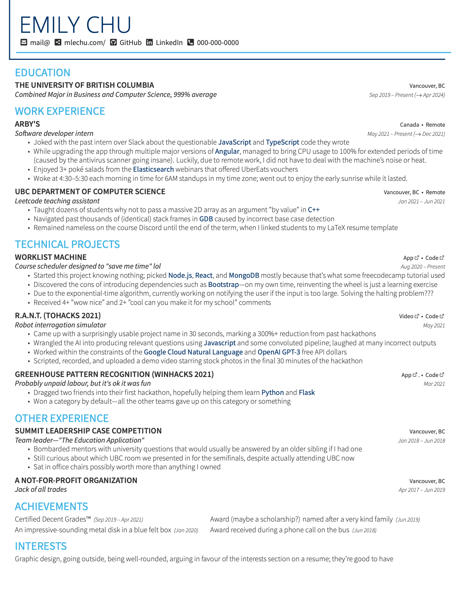

Back with another resume template, this time with one column!!!

Switched to one column because I actually "have experience" now. It should also help the  people who fear the debatably real ATS monster.

## What's new?
- Changed fonts
- Got rid of skills section, bolded technologies in the body
- Added project links and a wonderful TiKz external link icon
- Got rid of address on cover letter; it's 2021
- Added makefile; it can now compile resume, cl, and both without toggles

### Can I use it?
- Yes!
- Feel free to contribute as well

You better star the repo though 😎

### Compilation:
- If you have latexmk on your machine: `make res` for resume, `make cl` for cover letter, `make both` for a combined document, or `make` for all of the above
- Change PREFIX in the [Makefile](./Makefile) to your own name
- You can also use the [VSCode LaTeX extension](https://marketplace.visualstudio.com/items?itemName=James-Yu.latex-workshop) although you'll need to manually toggle resume/cl in [MAIN.tex](./MAIN.tex), and I don't know how to set the output directory with this method.

### Editing:
- Colors (MainTheme, LeftTheme, and RightTheme) are defined in the class file
- Fonts + sizes are also defined in the class file. Unused fonts are included if you want them!
- Spacing can be tweaked in the class file by changing \tabcolsep and \arraystretch

### The TODO:
- Certain spacings are still a quick fix
- Makefile using latexmk is slower than just using the LaTeX VSCode extension. Is there a way to speed it up?
- Magic number (\MagicVFill, approx. 700pt) must be changed if you change the height of the header. Otherwise, the vertical lines on the cover letter won't end the way I meant them to. Find a way to measure the header height dynamically, or fill remaining vertical space inside a minipage and tabular environment.